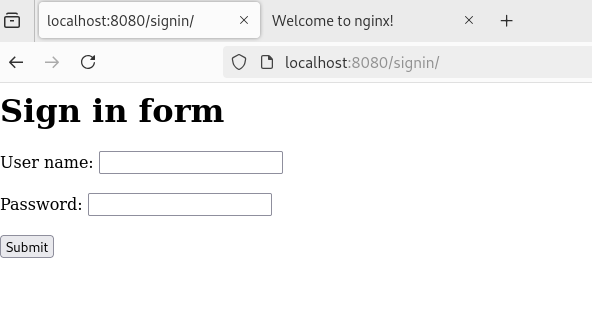

Результат

Команды чтоб собрать контейнеры для локального тестирования

1) `docker build . -t nginx`
2) `docker run -d --rm --name test__nginx -p 8080:80 nginx:latest`
3) после остановки тестирвоания удаление контейнера `docker rm -f test__nginx`