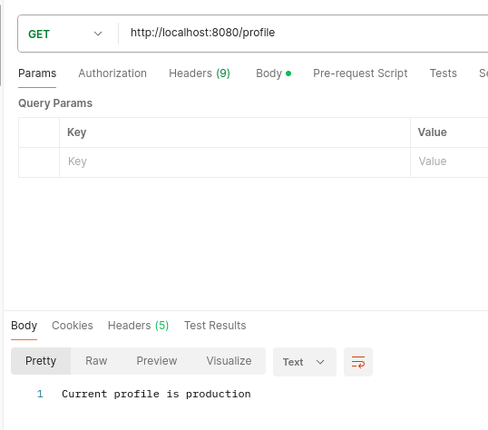
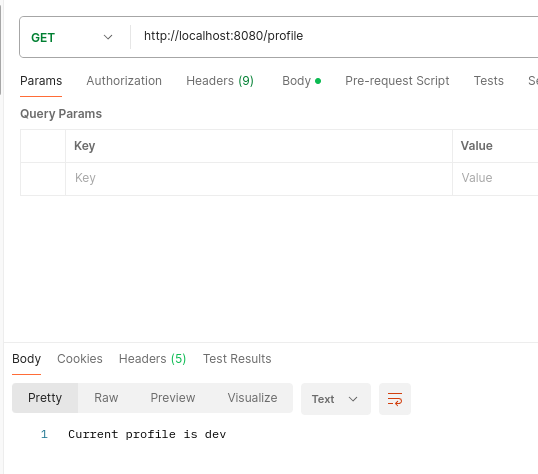
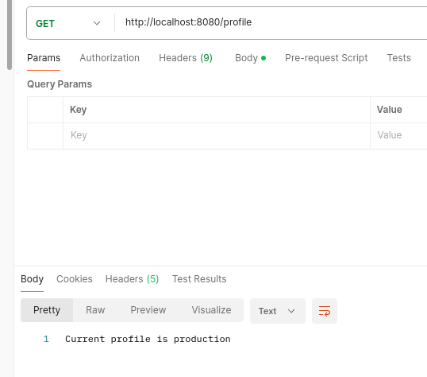

# Локальное тестирование

при false

при true

У `@ConditionalOnProperty` есть атрибут `matchIfMissing` означает что условие должно совпадать, если свойство не заданно
то по умолчанию false

Проверяем `#netology.profile.dev = true` 
1) Приложение запустилось, без него падало с ошибкой
2) будет возвращать тот ответ, куда мы добавим данный атрибут 

