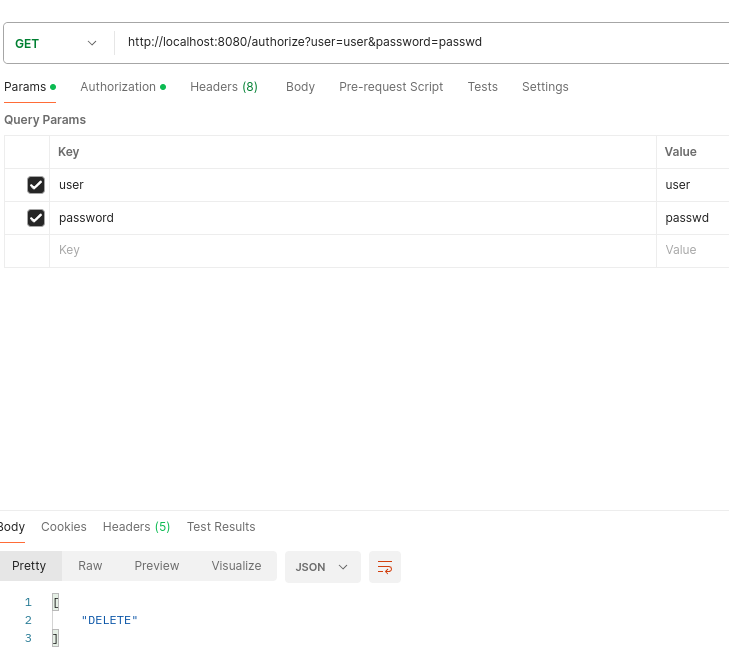
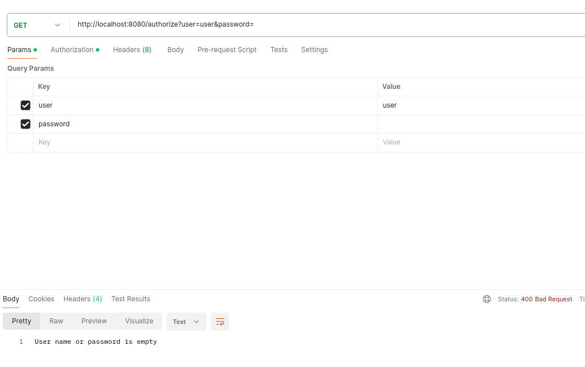
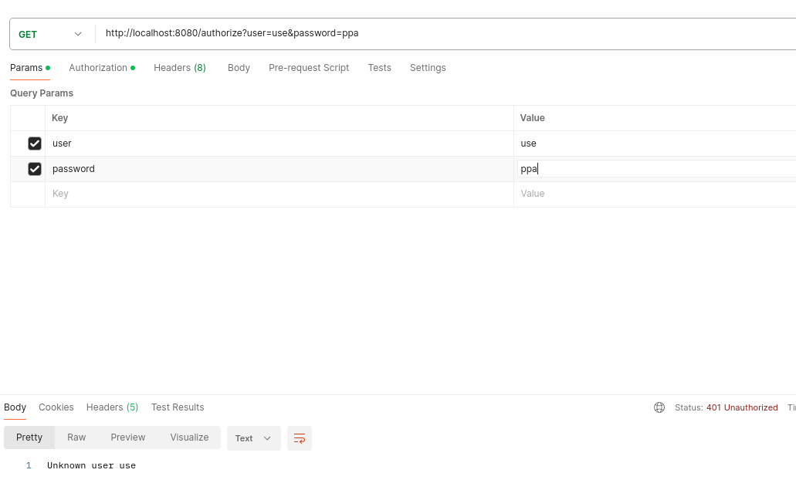

# Локальное тестирование

Для тестирования я создал 3 пользователей
```java
public UserRepository() {
        users.put("test", new User("test", "passwd", Authorities.READ));
        users.put("admin", new User("admin", "passwd", Authorities.WRITE));
        users.put("user", new User("user", "passwd", Authorities.DELETE));
    }
```

Теперь проверяем что Postman нам возвращает необходимое на корректный запрос



Пробуем ошибку на пустой пароль
 
Пробуем на не правильный логин

